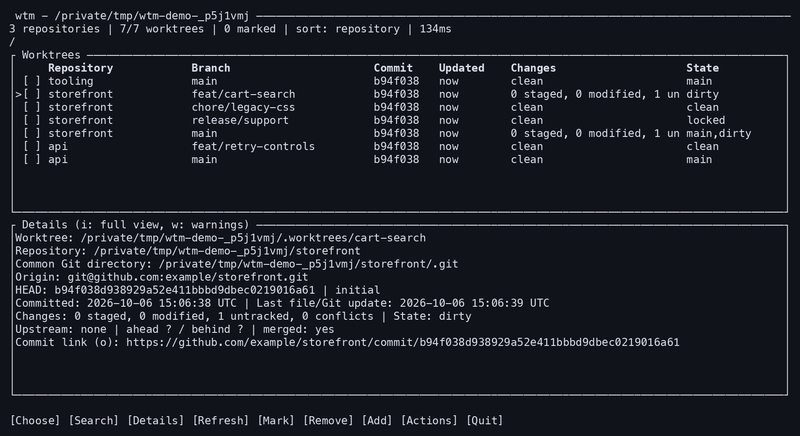
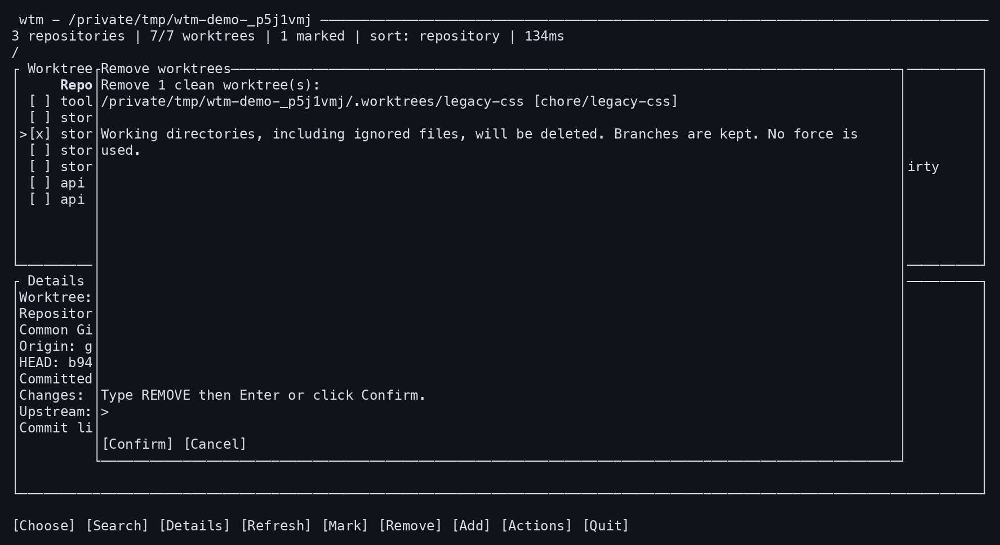

# wtm — Worktree Manager

`wtm` is a Rust terminal UI for finding and managing Git worktrees across a directory tree.
It scans the directory you give it, including repositories nested inside other checkouts,
hidden folders, ignored directories, and linked worktrees whose main repository lives elsewhere.

Use the keyboard, mouse, or scriptable CLI to inspect worktrees and review cleanup.
The project is in early development. No public release has been published yet.



Live terminal output from disposable demo repositories; see [how these captures are made](docs/screenshots.md).

## Install

Git 2.36 or newer is required. Release binaries do not require Rust or a package manager.
The release targets are macOS and Linux on x86_64 and Arm64. Windows is not a release
target; compatibility there is unverified. Use a terminal with at least 30 columns
and 14 rows for the dashboard.

After the first GitHub release is published, install its latest stable binary with:

```sh
curl -fsSL https://raw.githubusercontent.com/tiaanduplessis/wtm/main/install.sh | sh
```

The installer detects the platform, verifies SHA-256, and installs into `~/.local/bin`.
It leaves shell files unchanged. To choose a version or installation directory:

```sh
curl -fsSL https://raw.githubusercontent.com/tiaanduplessis/wtm/main/install.sh \
  | sh -s -- --version v0.1.0 --dir "$HOME/.local/bin"
```

Alternatively, download the matching archive from [GitHub Releases](https://github.com/tiaanduplessis/wtm/releases),
verify it against `SHA256SUMS`, and extract it. Archives contain the binary, project
license, documentation, and dependency notices. The checksums are not signatures.

### Source fallback

Install [Rust 1.88 or newer](https://rustup.rs). After the first release, build from its
source without cloning a checkout yourself:

```sh
cargo install --git https://github.com/tiaanduplessis/wtm.git --tag v0.1.0 \
  --locked --root "$HOME/.local"
```

From an existing source checkout, use `./scripts/install.sh`. Then try:

```sh
export PATH="$HOME/.local/bin:$PATH"
wtm list . --json
wtm .
```

Once the repository is public, a checkout is available from
`git clone https://github.com/tiaanduplessis/wtm.git`. The equivalent direct Cargo
command is `cargo install --path . --locked --root "$HOME/.local"`.
`WTM_INSTALL_ROOT` can change the source install root. Installation does not create
or remove worktrees. To uninstall, remove the installed `wtm` binary; shell integration
can be removed separately if you enabled it.

## Dashboard

```sh
wtm                         # Scan the current directory recursively
wtm ~/projects              # Include nested repositories and .worktrees
wtm --jobs 4 ~/code
wtm --exclude node_modules --exclude target ~/code
```

The table shows the owning repository, branch, abbreviated commit, last activity,
working-tree changes, and protection state. The details view includes the owner path,
remote, full commit hash and subject, commit time, upstream divergence, merge status,
and a hosted commit URL. Press `o` to open the commit on GitHub, GitLab, or Bitbucket.
Other remote hosts remain visible without an inferred link.

| Key | Action |
| --- | --- |
| `j` / `k`, arrows, PgUp / PgDn | Navigate |
| `/`, then Esc or Enter | Search repository, branch, or path |
| `s`, `S` | Cycle sorting; reverse the current order |
| `d` | Show only changed or unknown-status worktrees |
| `Space`, `c` | Mark worktrees; clear marks and filters |
| `Enter` | Exit and print the selected path |
| `i`, `w`, `e`, `P` | Full details, scan warnings, last operation, performance |
| `o` | Open the remote commit |
| `a` | Add a worktree on an existing or new branch |
| `x` | Review and remove the selected or marked clean worktrees |
| `m` | Move a worktree |
| `l` | Lock or review unlocking a worktree |
| `p` | Preview stale registration pruning for the selected repository |
| `f` | Confirm fetching remote updates |
| `r`, `R` | Refresh known repositories; repeat full recursive discovery |
| `v` | Open the Actions menu |
| `?`, `q` / Ctrl-C | Help; quit |

Mouse input is enabled by default. Click a row to select it, its checkbox to mark it,
or right-click for the Actions menu. The wheel navigates the table and scrolls open
previews. Click Repository, Updated, or Changes to sort; click again to reverse.
The visible buttons and Actions menu provide access to the keyboard commands.
Choosing a directory uses the Choose button; clicking a row keeps the dashboard open.

Click the search line or a form field to place its text cursor. Left/Right, Home/End,
Backspace/Delete, and clipboard paste edit the current field. Paste cannot submit a
form or confirm cleanup. Click Confirm only after entering the required confirmation.
For native terminal text selection, use `wtm --no-mouse`; many terminals also support
holding Shift while dragging. Mouse and clipboard modes are restored on exit.

Discovery overlaps with background Git inspection. Completed repositories appear
while the recursive scan continues. Resizing and navigation stay responsive while
scanning. Cached rows are marked as awaiting refresh; management stays disabled while
inspection runs. Mutations require review; raw terminal mode and the
alternate screen are restored on normal exit, errors, and panics. Pending mutations
finish before exit. The UI uses stderr, keeping stdout available for path selection.
The dashboard needs at least 30 columns and 14 rows.

## Commands and shell integration

```sh
wtm list ~/code --sort activity
wtm list . --json
wtm list . --profile           # Scan phases, Git costs, cache hits, time to first rows
wtm list . --links             # Clickable commit hashes in compatible terminals
wtm path feature --root ~/code
wtm cd                        # Interactive worktree picker
wtm cd feature --root ~/code
wtm exec feature --root ~/code -- git status

wtm add ../feature --repo . --branch feature --new-branch --from main
wtm remove ../feature --dry-run
wtm remove ../feature         # Type REMOVE to confirm
wtm lock ../feature --reason 'Keep this checkout'
wtm unlock ../feature         # Type UNLOCK to confirm
wtm unlock ../missing --repo . # Unlock an offline registration
wtm move ../feature ../renamed
wtm prune . --dry-run
wtm fetch .
```

Commands use native process arguments, not shell evaluation. Queries must be
unambiguous; use an exact worktree root path when names collide. `wtm path -0`
provides NUL-terminated paths, including those containing newlines.

For zsh, add these after `compinit` in `.zshrc`:

```zsh
if command -v wtm >/dev/null 2>&1; then
  source <(wtm completion zsh)
  eval "$(wtm shell-init zsh)"
fi
```

`wtm cd` then changes the current shell directory. Bash and fish directory
switching are also supported through `wtm shell-init bash` / `wtm shell-init fish`.
Completions support bash, zsh, fish, PowerShell, and Elvish.

## Status, activity, and cleanup

Changes use Git's staged, modified, untracked, and conflict status. Ignored files
are excluded, as with ordinary `git status`. An inspection error is shown as unknown,
never clean. Unknown-status, dirty, locked, primary, and bare worktrees cannot be
removed through the TUI. The CLI only permits dirty removal with explicit `--force`.
Locks and primary repositories remain protected even with force.

Last activity is the newest filesystem modification time among tracked and
nonignored untracked files and the worktree's HEAD, index, branch ref, and HEAD reflog.
A missing tracked file's parent directory time records deletion activity. Ignored
build outputs and unrelated shared Git metadata do not count. This is an activity
estimate, not a record of the last user interaction; commit time is shown separately.
Merge status uses ancestry against the remote default ref, or local `main` / `master`.
It does not infer squash merges, and remote refs are not fetched automatically.

Removing a worktree deletes its whole directory, including ignored files. Branches
are retained by default. `--delete-branch` attempts `git branch -d` only after removal;
Git can retain an unmerged branch and the command reports that partial outcome.
Worktrees containing nested repositories are protected to preserve their independent data.
Every management operation revalidates repository identity and the selected registration
before applying Git's own checks. Git provides file locking; the tool does not promise
atomicity against external changes between separate commands. Bulk removal reports
partial outcomes and refreshes the inventory if a later item fails.



Cleanup requires review and typed confirmation, whether you use the keyboard or mouse.

Prune is repository-wide: it previews stale administrative records and may include
registrations outside the current scan directory. Locked registrations are preserved.
It does not delete branches or existing worktree directories. Review its preview before
confirmation. `--yes` explicitly bypasses prompts for scripting; `--dry-run` makes no changes.

The scanner only skips Git administrative directories by default. Directory exclusions
are opt-in. Directory symlinks are not followed unless `--follow-links` is supplied;
cycles are reported, and links outside the physical scan root are not traversed.
Registered paths outside the root and excluded directories are omitted from the inventory.
Read errors remain visible. `wtm list` exits with code 2 when discovery or metadata has
warnings, and includes them in JSON. The JSON `discovery_complete` field distinguishes
omitted entries from metadata warnings on known entries. Fuzzy path queries require
complete discovery; an exact verified path remains usable despite unrelated failures. Other failures exit 1; `wtm exec` propagates its command's exit status.

## Performance and refresh

Startup and `R` perform full recursive discovery with the same coverage. `r` refreshes
known owners and their current registered worktrees, including newly added registrations.
Use `R` to find repositories created or moved since the last full scan. A mutation
refreshes its affected owner; bulk operations spanning owners refresh all known owners.

The bounded session cache stores commit metadata (up to 4,096 entries / 16 MiB) and
index-derived tracked file lists (up to 256 entries / 32 MiB).
It lives only in the current process. Commit keys include repository and full hash.
A fresh check bypasses the commit cache while replacement refs exist; cached reads
use the original immutable object. Abbreviations remain fresh. Index fingerprints
include timestamp, length, and filesystem identity where supported. Status, untracked paths, refs, and
file modification times are read again on refresh. Every tracked file is still checked,
including clean files whose timestamps changed. Inspection failures remain visibly
cached or unknown. Cleanup always revalidates against Git.

Press `P` for the last completed scan's measurements. JSON includes `profile`, and
`wtm list --profile` prints it to stderr. Discovery and inspection overlap, so their
wall times do not add to total elapsed time. Git and activity costs accumulate across
workers and can exceed elapsed time. `first_result_ms` measures the first inspected
repository with rows, not completion of discovery.

Compare builds using isolated real repositories:

```sh
python3 scripts/benchmark.py /path/to/baseline-wtm target/release/wtm
```

The benchmark alternates both binaries on the same fixture, checks identical inventory
and metadata, and reports median timings and command counts. It does not represent
every workspace or storage device. `--exclude` and `--jobs` remain explicit tuning options;
no directories or untracked changes are silently omitted to speed up inspection.

Local measurement on 2026-10-06: 12 repositories, 48 worktrees, 200 tracked files per
worktree, three alternating runs of each build. Both builds returned identical rows
and metadata. The optimized build showed its first completed repository in 275 ms.

| Median measurement | Before | Optimized |
| --- | ---: | ---: |
| Wall time | 1,183 ms | 550 ms |
| Git commands | 984 | 456 |
| Aggregate Git time | 6,842 ms | 3,468 ms |
| Aggregate activity time | 1,979 ms | 353 ms |

This fixture ran 2.15 times faster with 54% fewer Git commands. Filesystem caches were
warm across repeats; this is a local comparison, not a cold-disk or universal result.

Fetch is noninteractive. HTTP and file remotes use Git's usual transport. SSH remotes
use native OpenSSH with batch mode and a 15-second connection timeout, preserving
identities and host aliases from `~/.ssh/config`. Custom `core.sshCommand`,
`GIT_SSH_COMMAND`, or `GIT_SSH` commands are refused for SSH fetches: run Git directly
and refresh the dashboard instead.

## Development

See [CONTRIBUTING.md](CONTRIBUTING.md) for contributor setup, [SECURITY.md](SECURITY.md)
for vulnerability reporting, [CHANGELOG.md](CHANGELOG.md) for changes, and
[docs/releasing.md](docs/releasing.md) for release preparation.

```sh
cargo fmt --all -- --check
cargo clippy --all-targets --locked -- -D warnings
cargo test --all-targets --locked
cargo build --release --locked
python3 -m unittest discover -s tests -p 'test_*.py'
shellcheck install.sh scripts/install.sh
uv run --with pyte==0.8.2 scripts/tui_smoke.py target/release/wtm
```

Tests use isolated real Git repositories and worktrees. They cover nested discovery,
scoped ownership, metadata/status, detached and unborn heads, bare repositories,
submodules, lock and removal protections, unusual paths, CLI operations, shell switching,
and dashboard rendering and input states. No tests mutate your own repositories.
The optional Python/pyte smoke check exercises the real PTY, including piped stdout,
terminal restoration, resize handling, directory selection, and Git mutations.

CI is configured for Linux, macOS, and Rust 1.88. Release jobs build and test all four
native targets before assembling a draft. Hosted results and downloads must be verified
after the GitHub repository exists; local workflow files are not evidence of a passed run.

## License and support

Licensed under [MIT](LICENSE). Dependencies retain their own licenses and notices.
Use GitHub issues for public bugs and feature requests; suspected vulnerabilities follow
the private reporting instructions in [SECURITY.md](SECURITY.md). There is no support SLA.
This project distributes through GitHub releases and has no Homebrew or crates.io setup.
